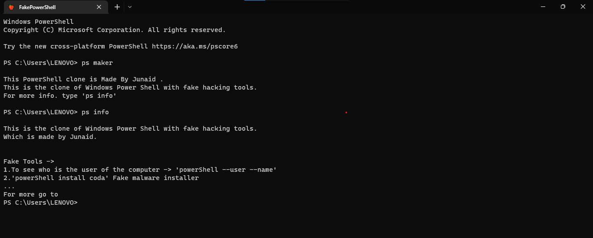
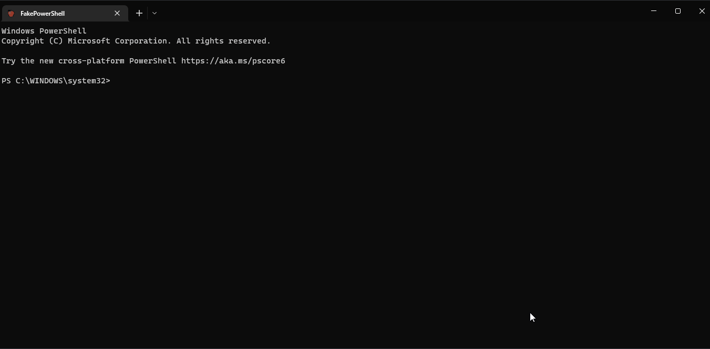

# Fake PowerShell

This is a fake PowerShell with acts like a real power shell and works like a power shell , but when we see which is real or fake , we can't identify , when you type - `ps maker` , that shows _This is a Fake Power Shell_ , that is fake power shell or it shows an error then this is real powershell. Made by [Junaid](https://abujuni.dev) .

**For Windows 11 users**
They have [Windows Terminal](https://apps.microsoft.com/store/detail/windows-terminal/9N0DX20HK701?hl=en-us&gl=IN) built in , they want to create a new terminal profile with emty terminal profile.Then they want to goto command line section and browse to cloned repository path and then select `fakepowershell.bat` , then save settings. open new windows terminal window and click on that `V` and select `fakePowerShell`, you got this fake power shell on anywhere at this cloned repository path.

_If your terminal location show `PS C:\WINDOWS\system32>` , Change some setting._

**Problem fixed !**

**For Good News for Windows 10 users**
They can download [Windows Terminal](https://apps.microsoft.com/store/detail/windows-terminal/9N0DX20HK701?hl=en-us&gl=IN) on they pc/laptop by downloading from Microsoft Store. After download , they want to create a new terminal profile with emty terminal profile.Then they want to goto command line section and browse to cloned repostery path and then select `fakepowershell.bat` , then save settings. open new windows terminal window and click on that `V` and select `fakePowerShell`, you got this fake power shell on anywhere at this cloned repostery path.

_If your terminal location show `PS C:\WINDOWS\system32>` , Change some setting._

**Problem fixed !**

---

## Version - 0.1.2

Latest version of FakePowerShell version - 0.1.2 , June 2022 .

- Bugs
- - `Unable find 'c:/../../../useful_python/powershell/powershell.py'` - fixed ✔
- - **_[Not Understand Installation](#bug-fixed-report)_** - fixed ✔
- - **_[Which OS system this supports](#bug-fixed-report)_** - fixed ✔

- New Addons -> new commands
- - `ps rm nm` - `Node_modules` remover .
- - `ps rm pyca` - `__pycache__` remover .

If you get any bugs , issue or any documentation error , contact me on my email , on my social media page or on github.

- Contact me
- - [Issues on Github](https://github.com/junaidcodingmaster/Fake-PowerShell/issues) .
- - [Get My Social media page](https://www.abujuni.dev/contact-me)
- - mohammedjunaidmaqsood8@gmail.com

### Bug Fixed Report

- _Not Understand Installation_ :
  Simply type - `python install.py` , not need of - `pip install -r requirements.txt` , all setup in one file .

- _Which OS system this supports_ :
  It supports only Windows 11 , 10 , 8 , 7 and XP (Only windows) .

---

## Installation
Get latest release of fake powershell . with install.py

**Made By [Junaid](https://abujuni.dev) .**
